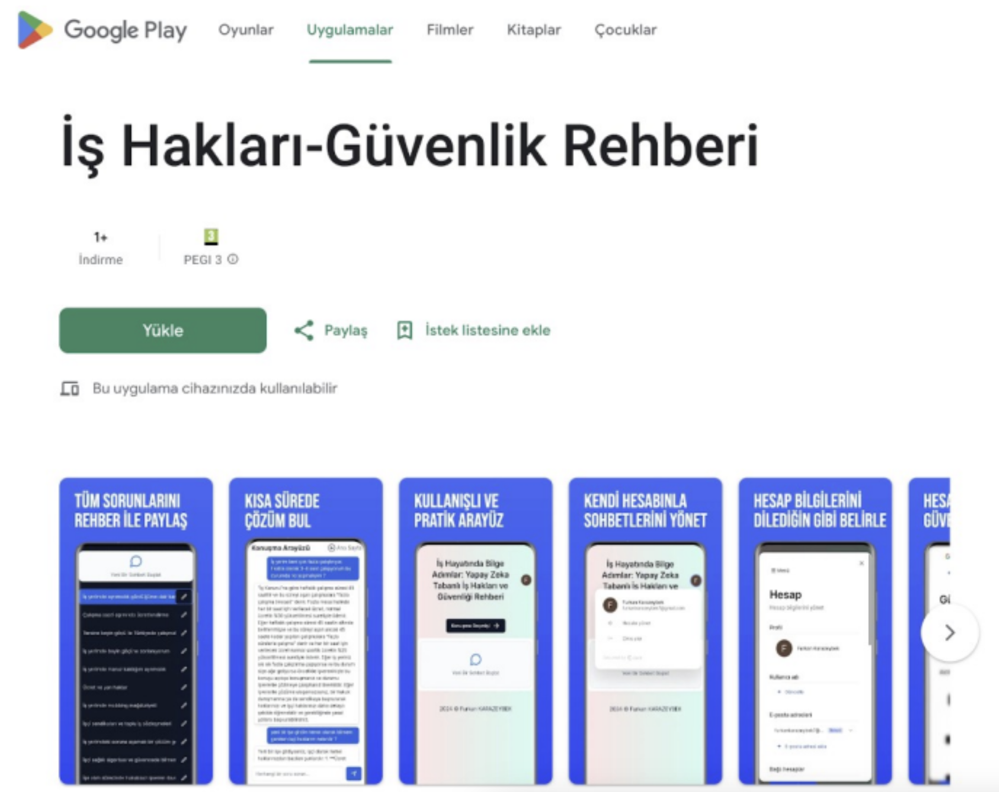
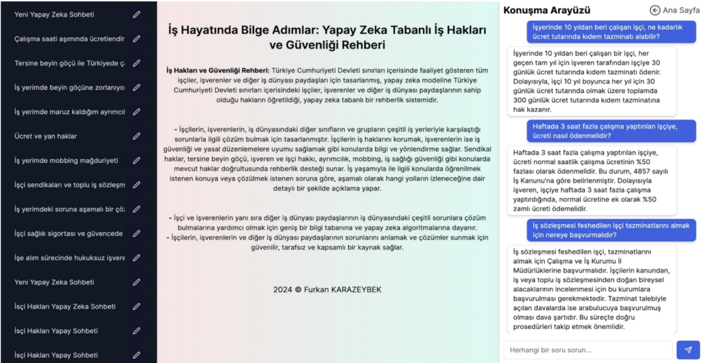

# 🤖 Yapay Zeka Destekli İş Hakları ve Güvenliği Rehberi - 


> **⚖️ Yasal Uyarı ve Sorumluluk Reddi:**
>
> 1. **Yarışma Projesi:** Bu uygulama, **"2024 Gençlik Farkında Tema Fikri Yarışması"** kapsamında sosyal farkındalık oluşturmak amacıyla geliştirilmiş bir prototiptir. Ticari bir ürün değildir ve ticari amaçla kullanılamaz.
> 2. **Hukuki Tavsiye Değildir:** Uygulamanın sunduğu içerikler, 4857 Sayılı İş Kanunu ve ilgili mevzuatlardan derlenen **genel bilgilendirme** niteliğindedir. Bu bilgiler, profesyonel hukuki tavsiye veya avukatlık hizmeti yerine geçmez.
> 3. **Yapay Zeka Sorumluluğu:** Cevaplar, RAG mimarisiyle desteklense de yapay zeka (LLM) modelleri tarafından üretilmektedir. Sistem nadiren de olsa hatalı veya güncel olmayan bilgi üretebilir. Kullanıcıların, bu bilgilere dayanarak alacakları hukuki aksiyonlardan doğabilecek maddi/manevi zararlardan geliştirici sorumlu tutulamaz.
> 4. **Kullanıcı Kabulü:** Bu uygulamayı kullanan herkes, yukarıdaki şartları kabul etmiş sayılır. 
> **Canlı Web Demo:** [yapay-zeka-is-haklari-ve-guvenligi-rehberi.vercel.app](https://yapay-zeka-is-haklari-ve-guvenligi-rehberi.vercel.app/)

> ⚠️ **PROJE DURUMU: MİMARİ DEMO (ARCHIVED)**
>
> Bu proje, **RAG (Retrieval-Augmented Generation)** mimarisini ve **PWA** yeteneklerini sergilemek amacıyla geliştirilmiş ve yarışma sürecini tamamlamıştır.
>
> **Maliyet optimizasyonu ve API güvenlik politikaları nedeniyle:**
> * **OpenAI API anahtarları** devre dışı bırakılmıştır. (Sohbet botu cevap üretmez). Ancak sistemin aktif olduğu dönemdeki fonksiyonel yeteneklerini ve cevap üretim kapasitesini kanıtlayan Web/Mobil ekran görüntüleri aşağıda sunulmuştur.
> * **AWS servisleri** askıya alınmıştır.
>
> Ancak; **Next.js App Router yapısı, Clerk kimlik doğrulama, Veritabanı şemaları ve Frontend arayüzü** incelenebilir durumdadır. Kaynak kodlar, modern bir AI uygulamasının nasıl kurgulanması gerektiğini gösteren bir referans niteliğindedir. 

Bu proje, Türkiye Cumhuriyeti iş mevzuatını ve iş güvenliği yönetmeliklerini **RAG (Retrieval-Augmented Generation)** mimarisiyle analiz eden, kullanıcılara hukuki dayanaklı cevaplar sunan yapay zeka destekli bir rehberdir.

**PWA (Progressive Web App)** teknolojisi sayesinde hem web'de hem de mobil cihazlarda (Google Play Store uyumlu) native uygulama performansı sunar.

## 📸 Proje Arayüzü ve Dağıtım

Uygulama, mobil öncelikli (mobile-first) tasarım prensibiyle geliştirilmiş olup, Google Play Store'da yayınlanmaya uygun PWA standartlarındadır.

| **Google Play Store & PWA** | **RAG Tabanlı Sohbet Arayüzü** |
|:-------------------------:|:-------------------------:|
|  |  |
| *Mobil uyumlu, mağaza listelemesi hazır PWA yapısı.* | *Mevzuat kaynaklı, halüsinasyon oranı düşük AI cevapları.* |

## 🚀 Öne Çıkan Özellikler

* **🧠 RAG Mimarisi:** Kullanıcı sorularını **Pinecone** vektör veritabanında aratarak, genel GPT cevabı yerine doğrudan ilgili kanun maddelerine (4857 Sayılı İş Kanunu vb.) dayalı yanıt üretir.
* **📱 Cross-Platform (PWA):** Tek kod tabanı ile hem Web, hem Android hem de iOS cihazlarda çalışır.
* **🔒 Kurumsal Güvenlik:** **Clerk** ile güvenli kimlik doğrulama ve oturum yönetimi.
* **⚡ Edge Computing:** **Vercel Edge Functions** ve **OpenAI Edge SDK** ile milisaniyeler içinde yanıt süresi.
* **📄 Akıllı Doküman Analizi:** İş sözleşmeleri ve hukuki belgeleri tarayıp özetleme yeteneği.

## 🛠️ Teknoloji Yığını (Tech Stack)

Proje, endüstri standardı en güncel "Modern Data Stack" teknolojileriyle geliştirilmiştir:

### Core & Frontend
* **Framework:** [Next.js 14](https://nextjs.org/) (App Router & Server Actions)
* **Language:** TypeScript
* **Styling:** Tailwind CSS, Shadcn/UI, clsx
* **State:** @tanstack/react-query

### AI & Data Engineering
* **LLM:** OpenAI API (GPT-4 Turbo & GPT-3.5)
* **Vector DB:** [Pinecone](https://www.pinecone.io/) (Serverless Vector Store)
* **Embedding:** OpenAI Text-Embedding-3-Small
* **Orchestration:** OpenAI Edge SDK

### Backend & Database
* **Database:** [Neon](https://neon.tech/) (Serverless PostgreSQL)
* **ORM:** [Drizzle ORM](https://orm.drizzle.team/) & Drizzle-kit
* **Auth:** Clerk (@clerk/nextjs)
* **Storage:** AWS SDK (S3 Compatible)

## ⚙️ Kurulum (Local Development)

Projeyi yerel ortamınızda geliştirmek için:

1.  **Repoyu klonlayın:**
    ```bash
    git clone [https://github.com/furkankarazeybek/yapay_zeka_destekli_is_haklari_rehberi.git](https://github.com/furkankarazeybek/yapay_zeka_destekli_is_haklari_rehberi.git)
    ```

2.  **Bağımlılıkları yükleyin:**
    ```bash
    npm install
    ```

3.  **Çevresel Değişkenleri (.env) Ayarlayın:**
    Gerekli API anahtarlarını (OpenAI, Pinecone, Clerk, Database URL) `.env` dosyasına ekleyin.

4.  **Veritabanını Senkronize Edin:**
    ```bash
    npx drizzle-kit push:pg
    ```

5.  **Uygulamayı Başlatın:**
    ```bash
    npm run dev
    ```

---
**Geliştirici:** [Furkan Karazeybek](https://github.com/furkankarazeybek)
